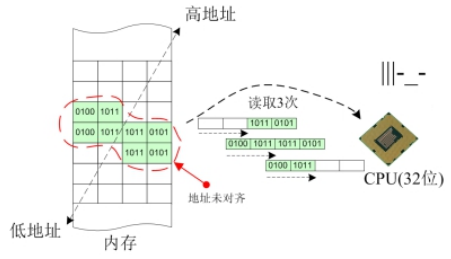

## 1. 基本概念
### 1.1 系统字长

系统字长也叫CPU字长，指的是处理器CPU在一条指令中的数据处理能力，当然这个能力还需要搭配操作系统的设定，比如常见的32位系统、64位系统，指的是在此系统环境下，处理器一次存储处理的数据可以达32位或64位。


### 1.2地址对齐
CPU字长确定之后，相当于明确了系统每次存取内存数据时的边界，以32位系统为例，32位意味着CPU每次存取都以4字节为边界，因此每4字节可以认为是CPU存取内存数据的一个单元。

如果存取的数据刚好落在所需单元数之内，那么我们就说这个数据的地址是对齐的，如果存取的数据跨越了边界，使用了超过所需单元的字节，那么我们就说这个数据的地址是未对齐的。

地址未对齐的情形：


地址已对齐的情形：


从图中可以明显看出，数据本身占据了8个字节，在地址未对齐的情况下，CPU需要分3次才能完整地存取完这个数据，但是在地址对齐的情况下，CPU可以分2次就能完整地存取这个数据。

**总结**：
如果一个数据满足以最小单元数存放在内存中，则称它地址是对齐的，否则是未对齐的。
如果发生数据地址未对齐的情况，有些系统会直接罢工，有些系统则降低性能。

## 2. M值

**地址对齐中 “m 值” 的核心定义**:

“m 值” 本质是变量 / 数据类型的对齐模数（alignment modulus），也常被称为 “对齐单位” 或 “对齐边界”。简单来说：
- 它表示 “变量的起始地址必须是 m 的整数倍”；
- 32 位系统中，m 值的大小由数据类型的基本大小 决定（这是编译器默认的对齐规则，也可通过`#pragma pack`修改）。

### 32 位系统下常见类型的默认 m 值（对齐模数）
数据类型	| 基本大小（字节） |	默认 m 值（字节） |	地址对齐要求（示例）
---|---|---|---
char| 1	| 1	| 地址可以是任意值（如 0x10000001、0x10000002）
short| 2| 	2	| 地址必须是 2 的倍数（如 0x10000002、0x10000004）
int/float| 	4| 	4	| 地址必须是 4 的倍数（如 0x10000004、0x10000008）
double| 	8| 	4（32 位系统）| 	地址必须是 4 的倍数（64 位系统 m 值为 8）
**结构体**| 	**成员中最大的 m 值**| 	**最大成员的 m 值**	| **结构体整体地址是最大成员 m 值的整数倍**


### 修改m值
```c
#include <stdio.h>

// 示例1：默认对齐（32位系统，默认m值=最大成员大小=4）
struct DefaultAlign {
    char a;    // 1字节，默认对齐到4字节（补3个空字节）
    int b;     // 4字节，对齐到4字节
    short c;   // 2字节，默认对齐到4字节（补2个空字节）
};

// 示例2：手动设置按1字节对齐（取消所有填充）
#pragma pack(1)  // 开始按1字节对齐
struct Pack1Align {
    char a;     // 1字节，无填充
    int b;      // 4字节，紧跟a，无填充
    short c;    // 2字节，紧跟b，无填充
};
#pragma pack()   // 恢复默认对齐规则

// 示例3：更安全的用法（push/pop，避免影响其他代码）
#pragma pack(push, 2)  // 保存当前规则，设置按2字节对齐
struct Pack2Align {
    char a;     // 1字节，补1个空字节（对齐到2字节）
    int b;      // 4字节，对齐到2字节（本身是2的倍数，无额外填充）
    short c;    // 2字节，无填充
};
#pragma pack(pop)      // 恢复到push前的默认规则

int main() {
    // 输出各结构体大小，直观看到对齐的影响
    printf("默认对齐结构体大小：%zu 字节\n", sizeof(struct DefaultAlign));  // 输出 12
    printf("pack(1)结构体大小：%zu 字节\n", sizeof(struct Pack1Align));    // 输出 7
    printf("pack(2)结构体大小：%zu 字节\n", sizeof(struct Pack2Align));    // 输出 8
    return 0;
}
```

## 3. 对齐边界

`__attribute__((aligned(n)))`:
- aligned 是属性名，n 是对齐边界（单位：字节），你这里写的 32 就表示 “变量 c 的起始地址必须是 32 的整数倍”；

- 这个属性优先级高于编译器默认对齐规则，也高于 #pragma pack 设置的对齐规则；
> **注意**：这是 GCC/Clang 编译器的扩展语法，不是标准 C 语言，MSVC 编译器不支持（MSVC 用 __declspec(align(n)) 替代）。

注意: 一个变量的 n 值只能提升，不能降低，且只能为正的2的n次幂。

例子:
```c
// 强制32字节对齐的char变量：地址必须是32的整数
// 地址必须是32的整数倍
char a __attribute__((aligned(32)));
```

**注意**: `__attribute__((aligned(n)))` 不修改 数据类型的默认 m 值（对齐模数），它只是为被修饰的变量 / 类型设定了最小对齐要求；

3.1 对齐规则的优先级：

`__attribute__((aligned(n)))` > 编译器默认对齐 > `#pragma pack(n)`。

## 4. 结构体大小

“三步走”：定对齐边界→算成员偏移 + 填充→补末尾填充，就能解决所有结构体大小计算问题。

### 4.1 成员对齐原则
- 每个成员的起始地址，必须是该成员 “有效对齐边界(自身大小)” 的整数倍；
- 最大有效对齐边界：结构体所有成员的有效对齐边界中，数值最大的那个。结构体大小最大对齐边界的整数倍
- 当元素偏移完毕后就需要将结构体填充至最大元素的整数倍

## 5. 开发

在实际应用中要注意,结构体成员顺序会影响结构体大小.所以在创界结构体的时候请让结构体经可能占更少的内存.


