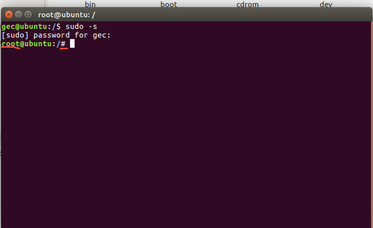

# linux相关命令
## 1.字符界面/终端的介绍

```shell
gec@ubuntu:~$    命令行提示符

gec ---》用户名
@   ---》分隔符，用于区分主机名和用户名
ubuntu---》主机名
:   ---》分隔符，用于区分主机名和工作路径
~   ---》当前的工作路径，此处代表用户目录/家目录 （/home/gec 的简称）
$   ---》代表当前身份为普通用户
```

## 2.切换超级用户
```shell
sudo -s
```


## 3.cd 切换到指定目录

- cd  目标路径的绝对路径
- cd  目标路径的相对路径

**绝对路径**：从根目录开始写，逐层地往下写。（不会理会当前在哪个路径下）

**相对路径**：相对于当前路径而言，目标路径在哪里。  

相对路径记住两个路径符号 `.` 和 `..`
- `.`: 当前目录
- `..`: 上一级目录


```shell
# 假设当前终端所在路径是 /home/gec
# 绝对路径访问共享文件夹
cd /mnt/hgfs/share

# 假设当前终端所在路径是 /home/gec
# 相对路径访问共享文件夹
cd ../../mnt/hgfs
```

### cd的特殊用法
```shell
# 返回上一级
cd .. 

# 访问家目录
cd ~

# 访问根目录
cd \

# 返回上一次的路径
cd -
```

## 4.罗列当前目录下的内容 
```shell
# 展示当前目录下可见文件名字
ls   
# 以 详细的方式 罗列
ls  -l    
# 显示所有的文件，包括隐藏文件 
# linux 中文件名以符号 . 开头的都是隐藏文件
ls  -a    
# 详细的方式一个文件的详细信息 包括隐藏文件
ls  -la   
```
### 解读文件的列表信息
```shell
drwxrwxrwx 1 root root  0 Jan  6 00:24 day01
drwxrwxrwx 1 root root  0 Jan  4 23:09 day02
-rwxrwxrwx 1 root root 99 Jan  6 00:55 demo.c
```
其中第一个字符表示文件类型：
- `-` 普通文本文件
- `d` 目录文件
- 其他 后续课程补充

后续跟的是不同角色的访问权限
```
rwx      rwx          rwx
当前用户  当前用户组    游客

r： 表示可读
w： 表示可写
x： 表示可执行
```
## 5.创建文件/创建目录

```shell
# 创建目录
mkdir 目录名称

# 创建文件
touch 文件名
```
## 6.删除文件/删除目录
```shell
# 删除文件
rm 要删除的文件

# 注意删除目录文件要带参数
# -r：r表示递归的（一层层的删除）
# -rf：force强制删除  
rm 要删除的目录名字 -r
```

## 清除屏幕

```shell
clear 
```

## 展示当前的绝对路径
```shell
pwd
```

