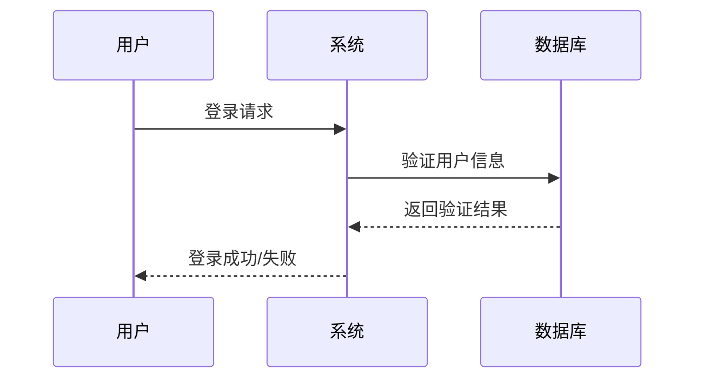

### 任务列表 
 - [ ] aaa
### 数学公式
$$
a = b * c
$$
### 表格
 |a|b|c|
 |:---|---:|:---:|
 |dw|da|da|

### 脚注
三连 [^ 三连]

[^ 三连]: 123 1234 1234

### 横线

---

### 链接
[LongGuan](longuan.top "一个网址")

[ID](网址 “别名”)

eg  请参考[表格](#表格)

### 斜体

*斜体

### 加粗
**加粗**

### 下划线
<u>下划线</u>

### 高亮
<mark> 高亮文字</mark>

### 下标
H_2_O

### 引用
> 一句话

